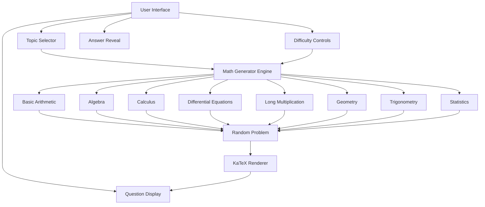

# Math Question Generator - Glass HUD Design

## Overview
A minimalistic glass HUD-style web application that generates random math equations across all levels from grade 9 math to differential equations, with a special focus on long multiplication problems.

## Architecture



## Math Topics & Difficulty Levels

### Grade 9 - Basic Level
- Arithmetic operations
- Fractions and decimals
- Basic equations
- Ratios and proportions

### Geometry
- Triangle properties
- Circle calculations
- Area and perimeter
- Pythagorean theorem

### Trigonometry
- Sine, cosine, tangent
- Unit circle
- Trigonometric identities
- Right triangle problems

### Statistics & Probability
- Mean, median, mode
- Standard deviation
- Probability calculations
- Data analysis

### Algebra
- Linear equations
- Quadratic equations
- Polynomials
- Factoring
- Systems of equations

### Calculus
- Derivatives
- Integrals
- Limits
- Chain rule applications

### Differential Equations
- First-order ODEs
- Second-order ODEs
- Separable equations
- Linear equations

### Special: Long Multiplication
- Multi-digit multiplication
- Large number products
- No calculator style problems

## Additional Features
- **Timer**: Countdown timer for practice sessions
- **Score Tracking**: Correct/incorrect counters
- **Difficulty Levels**: Easy, Medium, Hard per topic
- **History**: Previous questions log

## Technical Stack
- HTML5 + CSS3 (Glass HUD effect with backdrop-filter)
- JavaScript (ES6+)
- KaTeX for math rendering
- No external frameworks (vanilla JS)

## File Structure
```
/
├── index.html      # Main HTML with KaTeX CDN
├── styles.css      # Glass HUD styling
├── script.js       # Math generation logic
└── plans/
    └── math-hud-generator.md
```

## UI Design (Glass HUD)
- Semi-transparent background
- Blur effect on backdrop
- Clean, minimal controls
- Centered question display
- Smooth animations for question transitions
- Dark theme with light text for contrast

## Implementation Notes
- All equations generated algorithmically (no hardcoded questions)
- Random number generation with appropriate ranges per difficulty
- Answer validation and display on demand
- Responsive design for all screen sizes